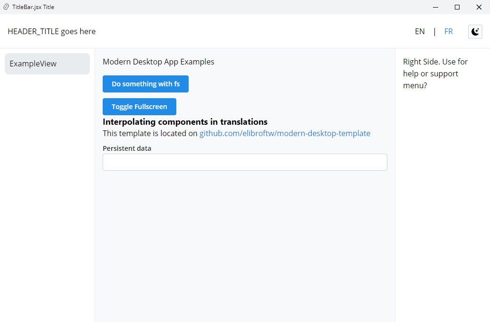

# TAURI E REACT
👨‍🏫PROJETO CRIADO PARA O CURSO DE TAURI.

 <br>
 <br>

## DESCRIÇÃO:
Este projeto utiliza Tauri para criar um aplicativo de desktop moderno com uma interface de usuário construída em React. A interface inclui botões para realizar ações como manipulação de arquivos e alternância para o modo de tela cheia.

## FUNCIONALIDADES:
1. **Interface de Usuário:**
   - **Botão "Do something with fs":** Este botão executa uma ação relacionada ao sistema de arquivos, como leitura ou escrita de arquivos.
   - **Botão "Toggle Fullscreen":** Este botão alterna o modo de tela cheia do aplicativo.
   - **Suporte a múltiplos idiomas:** A interface oferece opções para alternar entre os idiomas EN (Inglês) e FR (Francês).
   - **Modo claro/escuro:** Há um botão para alternar entre o modo claro e escuro da interface.

2. **Componentes Interpolados nas Traduções:**
   - O projeto usa componentes React interpolados nas traduções, permitindo a inclusão de componentes dinâmicos e interativos nas mensagens traduzidas.

3. **Persistência de Dados:**
   - Uma seção para dados persistentes, que podem ser salvos e recuperados entre sessões.

## COMO USAR?
1. **Configuração do Ambiente:**
   - Instale as dependências do projeto (no diretório `CODIGO`). 
     ```bash
     npm install
     ```

2. **Execução do Projeto:**
   - Para iniciar o aplicativo em modo de desenvolvimento:
     ```bash
     npm run tauri dev
     ```

3. **Build do Projeto:**
   - Para compilar o aplicativo para produção:
     ```bash
     npm run tauri build
     ```

## NÃO SABE?
- Entendemos que para manipular arquivos nas linguagens relacionadas, é necessário possuir conhecimento nessas áreas. Para auxiliar nesse aprendizado, oferecemos cursos gratuitos disponíveis:
* [CURSO DE HTML E CSS](https://github.com/VILHALVA/CURSO-DE-HTML-E-CSS)
* [CURSO DE JAVASCRIPT](https://github.com/VILHALVA/CURSO-DE-JAVASCRIPT)
* [CURSO DE REACT](https://github.com/VILHALVA/CURSO-DE-REACT)
* [CURSO DE RUST](https://github.com/VILHALVA/CURSO-DE-RUST)
* [CONFIRA MAIS CURSOS](https://github.com/VILHALVA?tab=repositories&q=+topic:CURSO)

## CREDITOS:
- [PROJETO CRIADO PARA O CURSO DE TAURI](https://github.com/VILHALVA/CURSO-DE-TAURI)
- [PROJETO FEITO PELO VILHALVA](https://github.com/VILHALVA)


